# Data Flow

เอกสารนี้สรุป data flow ของโปรแกรมในสองมุม:

- flow แยกตาม endpoint ของ `govdoc-api`
- flow รวมของทั้งโปรแกรม ตั้งแต่ desktop UI จนถึง storage, model backends, OCR, และ renderer

## ภาพรวมสถาปัตยกรรม

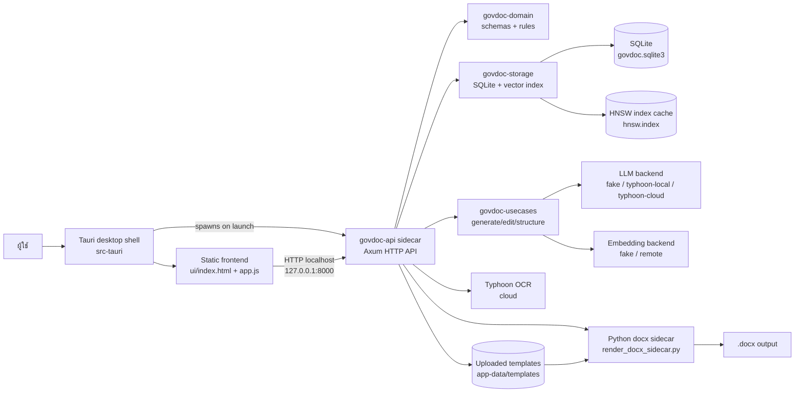

## Flow รวมของโปรแกรม

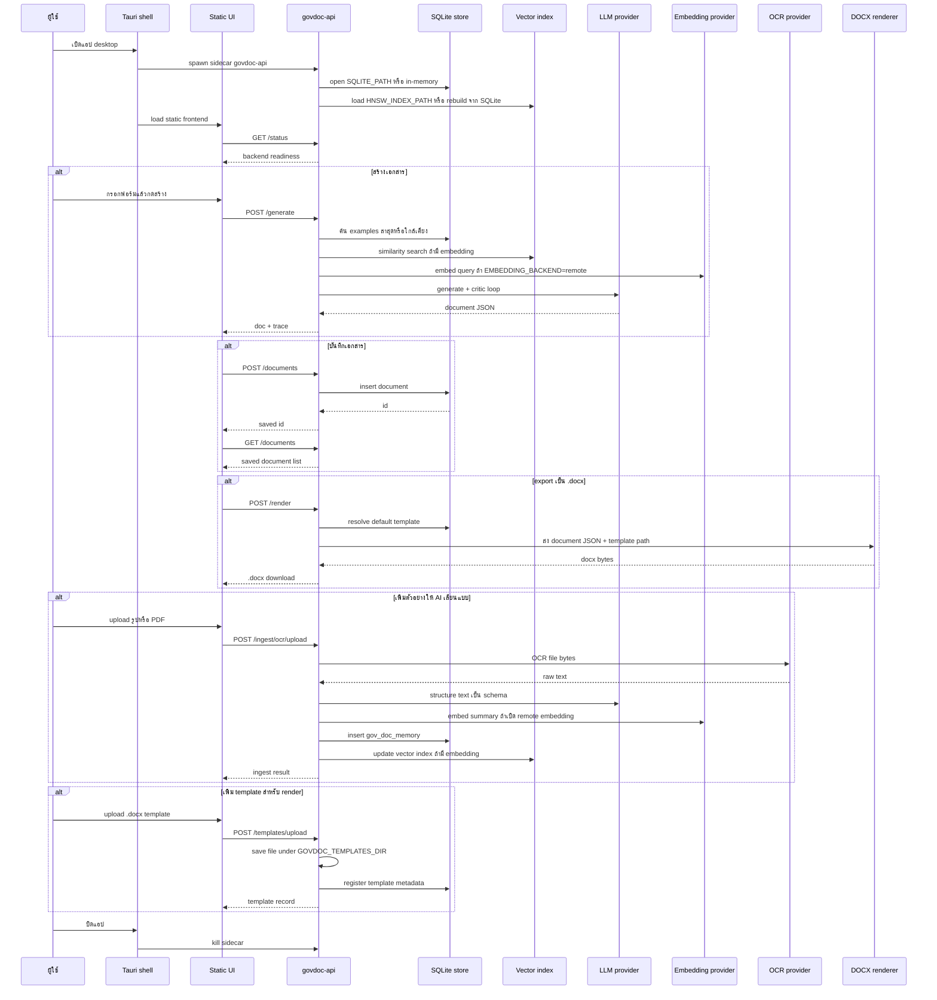

## Flow แยกตาม endpoint

### Health และ status

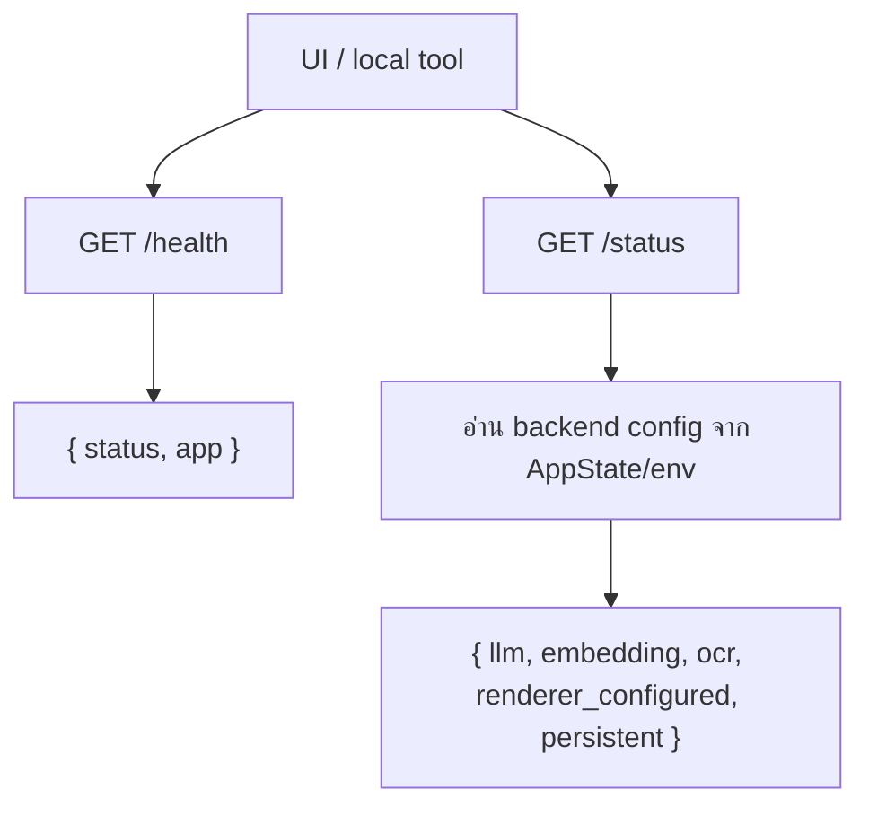

### Generate document

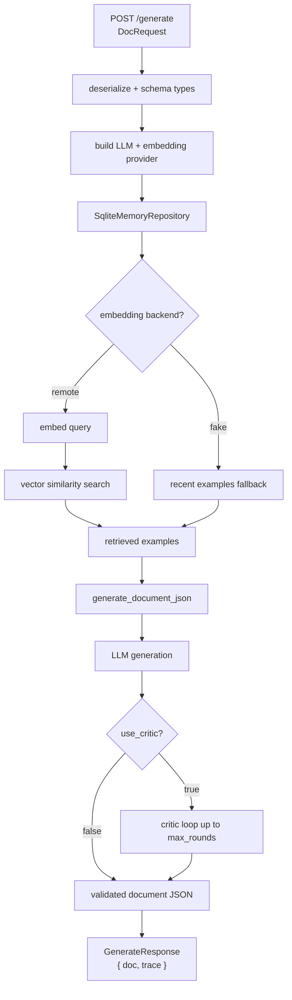

### Edit document

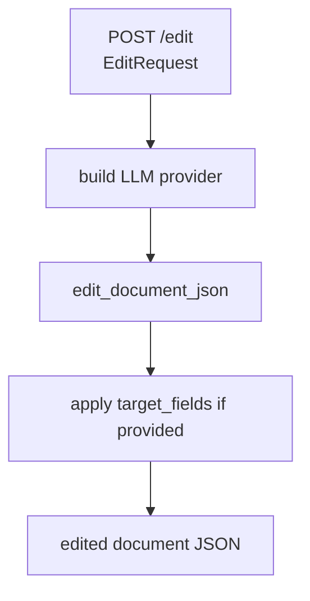

### Render document to DOCX

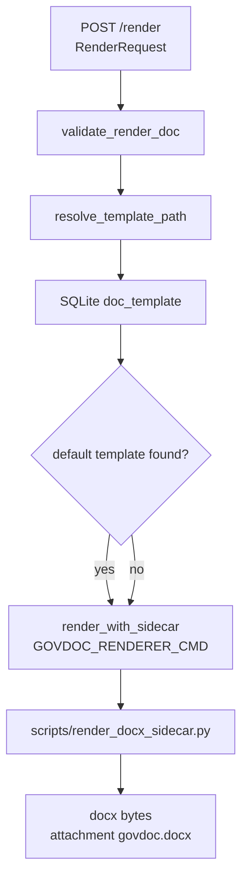

### Ingest structured example

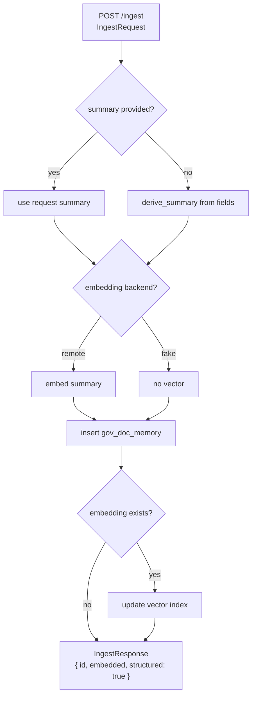

### Ingest OCR from local path

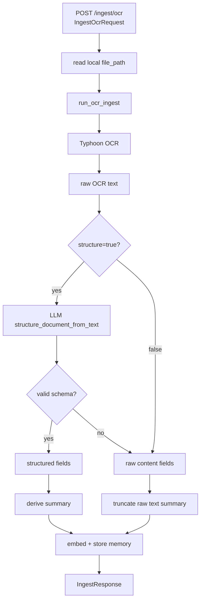

### Ingest OCR upload

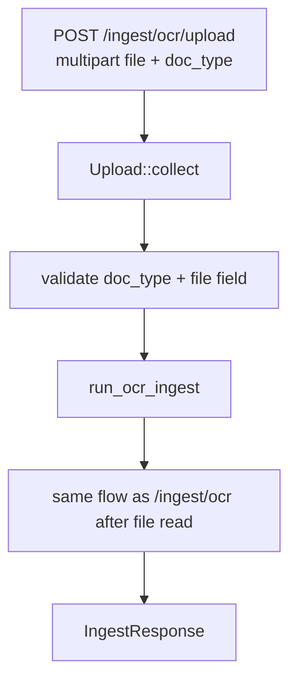

### Template management

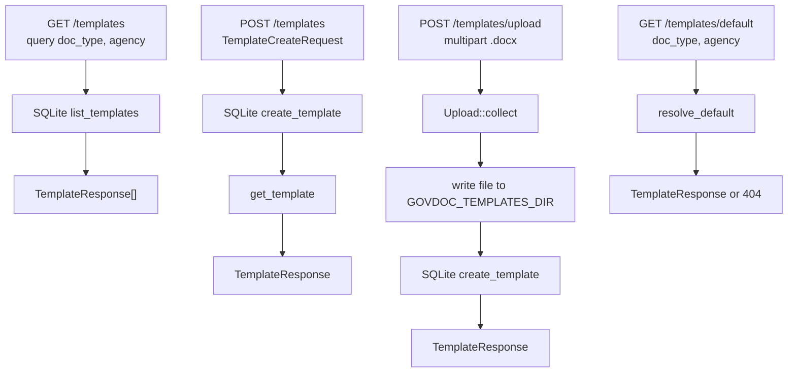

### Saved documents

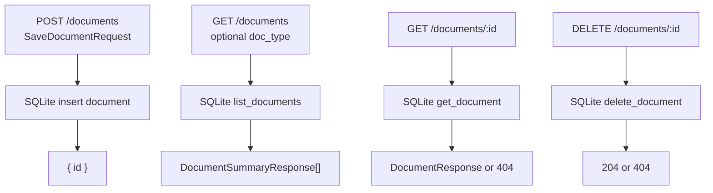

## Runtime data

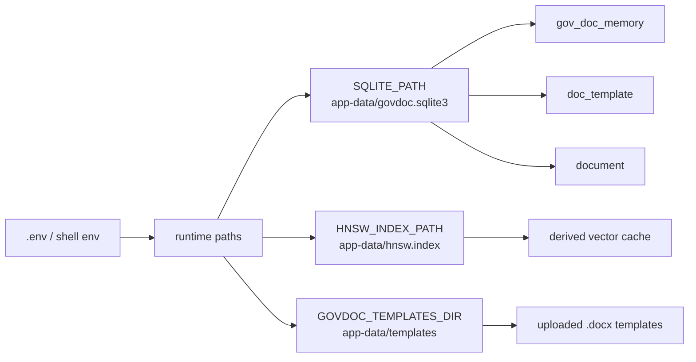

หมายเหตุ: runtime data ควรถูก ignore จาก git เพราะเป็น state ของเครื่องผู้ใช้ ไม่ใช่ source code.
